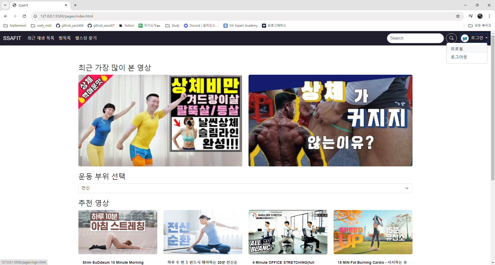

# [유영] - SSAFIT PROJECT

## 목차
- [프로젝트 개요](#프로젝트-개요)
- [내 역할](#내-역할)
- [메인 화면 구현](#메인-화면-구현)
- [JavaScript를 이용한 동적 기능 구현](#javascript를-이용한-동적-기능-구현)
- [기술 스택](#기술-스택)
- [배운 점](#배운-점)

## 내 역할
프로젝트에서 저는 **메인 화면 설계 및 구현**과 **JavaScript를 이용한 동적 기능 구현**을 담당하였습니다.

## 메인 화면 구현
메인 화면은 프로젝트의 첫인상이며, 사용자가 웹사이트를 이용하는데 있어 중요한 역할을 합니다. 메인 화면의 설계에서부터 구현까지 다음과 같은 작업을 수행했습니다:
     

- **UI 디자인 및 레이아웃 구성**: 사용자가 직관적으로 이해할 수 있도록 화면 요소를 배치하고, 부트스트랩을 활용해 반응형 디자인을 구현했습니다.
- **네비게이션 바 설계**: 주요 메뉴와 검색 기능을 네비게이션 바에 통합하여 사용자가 쉽게 사이트를 탐색할 수 있도록 했습니다.
- **최근 재생 목록 및 추천 영상 표시**: 사용자 맞춤형 콘텐츠를 메인 화면에 표시하여, 개인화된 경험을 제공했습니다.

## JavaScript를 이용한 동적 기능 구현
프로젝트에서 JavaScript를 활용하여 웹 페이지의 동적 기능을 구현했습니다. 주요 작업은 다음과 같습니다:

- **동적 콘텐츠 로딩**: JSON 데이터를 불러와 운동 영상 목록을 동적으로 생성하고, 운동 부위별 필터링 기능을 추가했습니다.
- **캐러셀 기능**: 최근 재생된 영상을 캐러셀로 보여주어 사용자가 쉽게 이전에 시청한 콘텐츠를 찾을 수 있도록 했습니다.
- **이벤트 핸들링**: 버튼 클릭, 폼 제출 등 다양한 사용자 상호작용을 처리하여 부드러운 사용자 경험을 제공했습니다.

## 기술 스택
- **HTML/CSS**: 메인 화면의 구조와 스타일링
- **JavaScript**: 동적 기능 구현 및 사용자 인터페이스 개선
- **Bootstrap**: 반응형 디자인 및 기본 UI 컴포넌트 활용

## 배운 점
이 프로젝트를 통해 웹 애플리케이션에서의 동적 콘텐츠 관리와 사용자 인터페이스 설계에 대한 경험을 쌓을 수 있었습니다. 특히, JavaScript를 활용한 데이터 처리와 사용자 이벤트 핸들링에 대해 깊이 이해하게 되었습니다. 또한, 팀원들과의 협업을 통해 작업을 원활하게 수행할 수 있는 능력을 배웠습니다.
