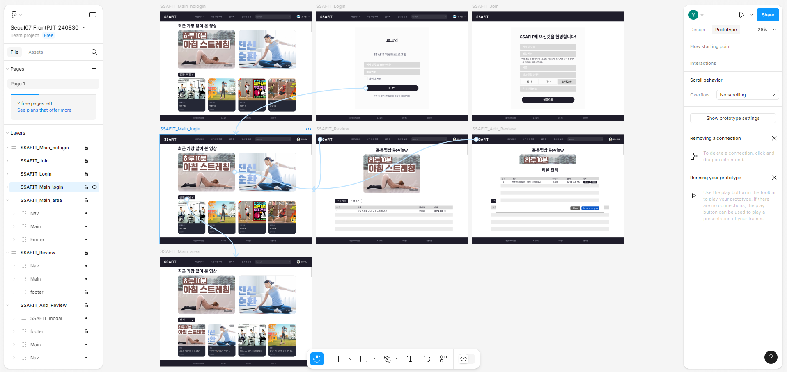
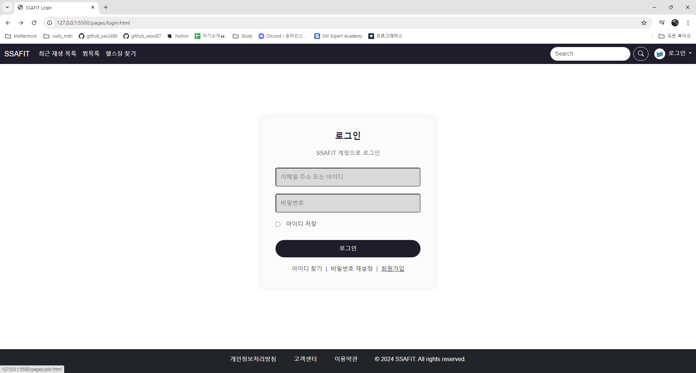
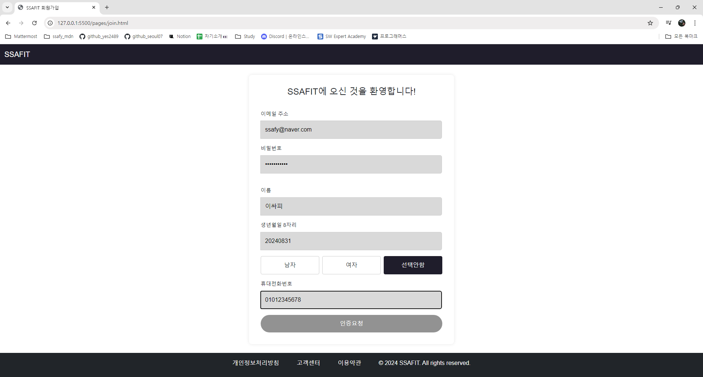
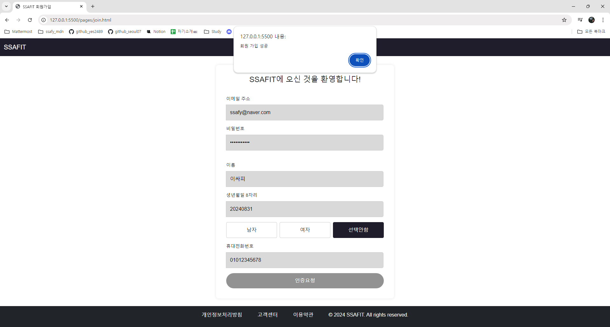
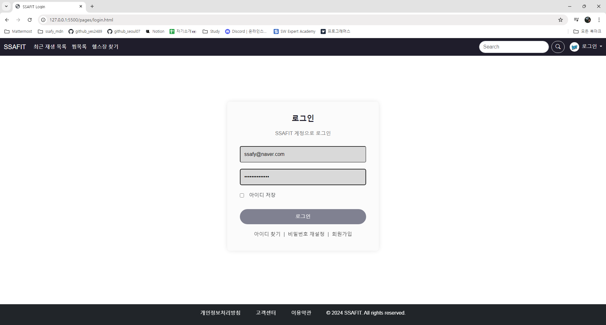
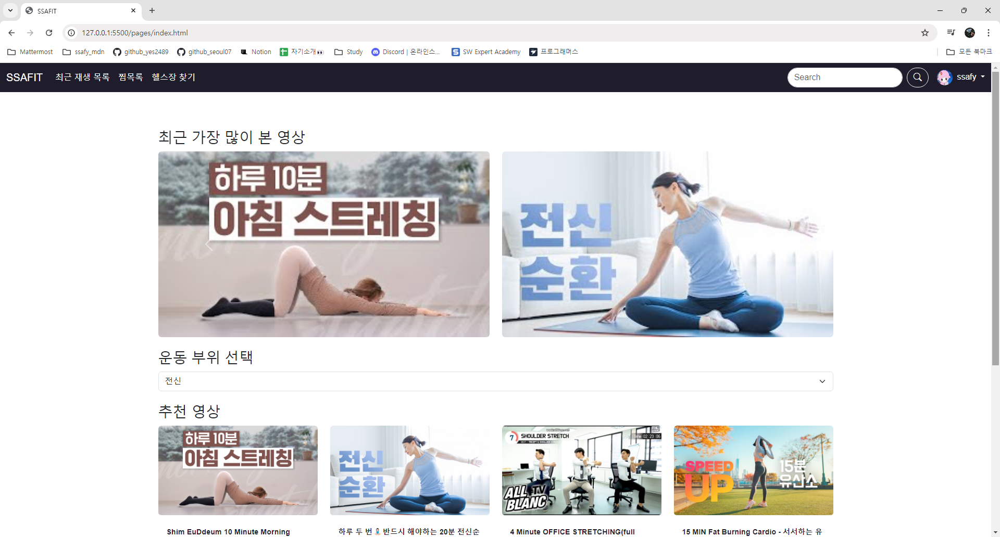
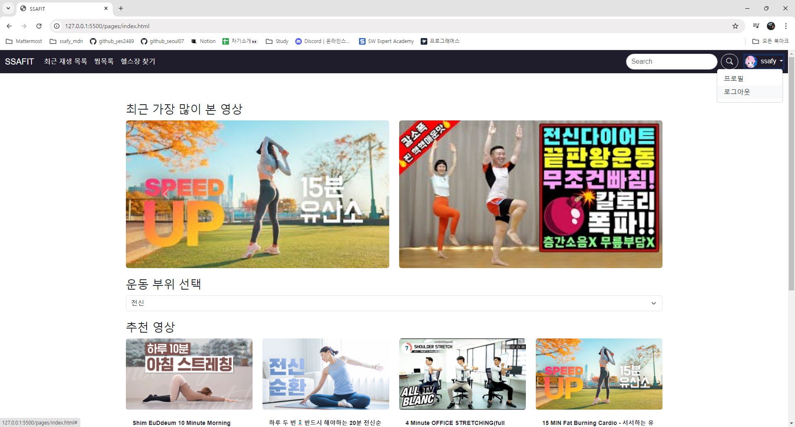

# 양은서_README.md
SSAFIT_Frontend 프로젝트에 기여한 내용 요약 및 배운 점을 기록한 문서입니다.

## 1. 프로젝트 기여점

### 프로토타입 작성
- 웨이브, 왓챠, 유튜브 등 동영상 스트리밍 서비스의 사용자 경험(UX) 요소를 분석하여 다음과 같은 개선 방안을 도입하였습니다.
    - **간단한 탐색 구조**: 직관적인 메뉴와 버튼 배치를 통해 사용자가 필요한 기능을 쉽게 찾을 수 있도록 최적화하였습니다.
    - **시각적 깔끔함**: 불필요한 요소를 최소화하고 사용자 인터페이스를 단순화하여 시각적으로 쾌적한 경험을 제공합니다.
- Figma 툴을 활용하여 구현할 기능을 시각적으로 표현하며 개발 방향을 파악할 수 있었습니다.   
    

### 로그인 및 회원가입 화면 구현
- **회원가입 (join.html)**
    - 사용자가 SSAFIT에 회원가입할 수 있는 페이지로, 이메일, 비밀번호, 이름 등의 정보를 입력받아 계정을 생성할 수 있는 화면을 구현하였습니다.   
       
       
       

- **로그인 (login.html)**
    - 기존 회원이 이메일과 비밀번호를 입력하여 로그인할 수 있는 페이지로, '@'를 기준으로 이메일을 구분하여 사용자 인증을 수행합니다.
    - 로그인에 성공하면 개인화된 인터페이스로 이동합니다.   
       
       
       
       

## 2. 프로젝트 내 개선 필요점 및 추가 아이디어
**1. 로그인 화면 진입의 불편함**
- 로그인 화면에 진입할 때 드롭다운 클릭 후 프로필을 한 번 더 클릭해야 하는 번거로움이 있습니다. 이는 설계 단계에서의 실수로, 향후 프로젝트 진행 시 더 꼼꼼히 확인할 필요가 있습니다.

**2. 메인 화면과 영상 리뷰 화면의 통일성 부재**
- 팀원이 각자 파트를 맡아 페이지를 만들면서 의사소통이 부족했습니다. 시간이 촉박하더라도 통일성을 필요로 하는 부분에 대해 충분한 논의 시간이 필요하다고 판단됩니다.

**3. 소셜 미디어 공유 버튼 추가**
- 영상 옆에 SNS 공유 버튼을 추가하여 사용자가 쉽게 영상을 공유할 수 있도록 하면 좋을 것 같습니다.

**4. 사용자 경험 개선을 위한 추천 운동 목록 개선안**
- 운동 카테고리를 유산소, 근력, 유연성 등으로 분류
- 난이도별 사용자 맞춤형 추천
- 체력 향상, 근육 증가, 체중 감량 등 사용자 목표에 맞춘 운동 추천
- 장비 필요 여부에 따른 사용자 환경에 맞는 운동 추천

## 3. 프로젝트를 통해 배운 점 / 느낀 점
### 1. JS 사용 능력 확인
- HTML과 CSS는 직접 작성이 가능하지만, JS는 ChatGPT에 의존해야 하는 수준임을 깨달았습니다. 특히 GPT 코드를 그대로 사용할 경우 오류 발생 시 원인 파악이 어려워 시간이 다소 소요되었습니다. 따라서 기본적인 문법을 정확하게 알고 있어야겠다고 느꼈습니다.

### 2. 협업 시 의사소통의 중요성
- 프로토타입을 통해 팀원들이 동일한 목표와 인사이트를 가지고 효과적인 협업을 할 수 있을 것이라는 기대가 있었으나, 시간이 촉박하여 프로토타입과 개발이 분리되어 진행된 점이 아쉬웠습니다. 앞으로 남은 2회의 프로젝트 진행 시 팀원들과 충분한 의사소통의 중요성을 인식하고, 현재 진행 중인 작업을 공유하는 부분과 바로 개발부터 시작하는 것이 아닌 반드시 명세서 해석을 진행 후 개발로 넘어갈 필요성을 느꼈습니다.
